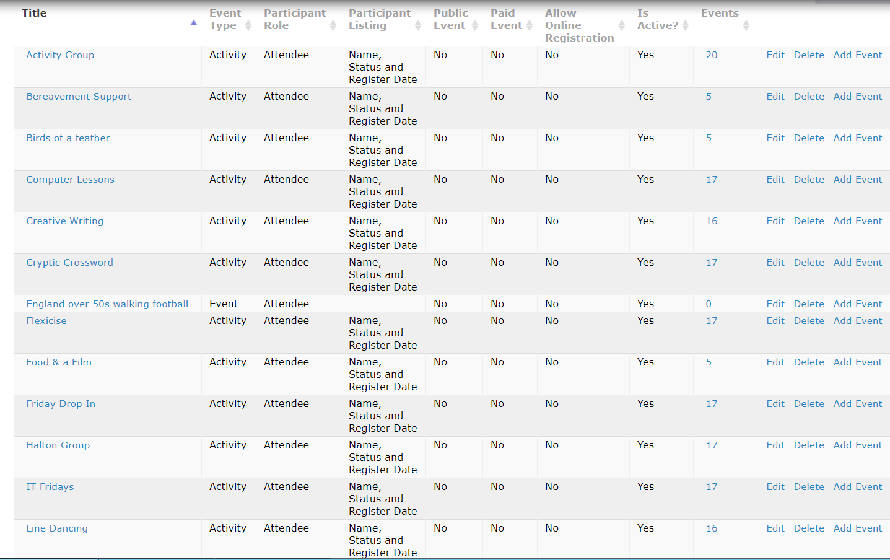
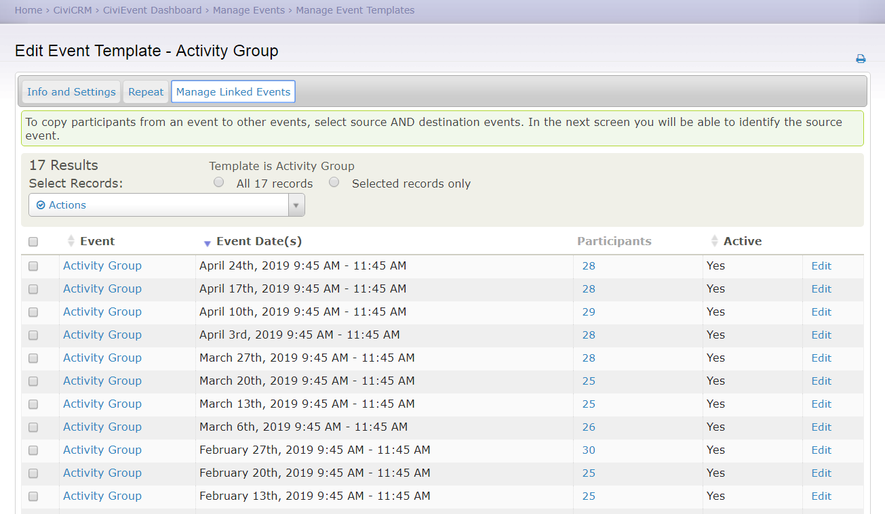
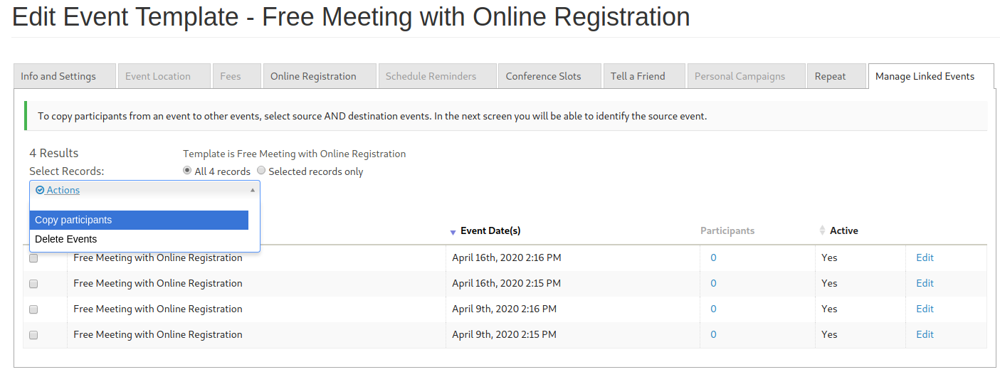
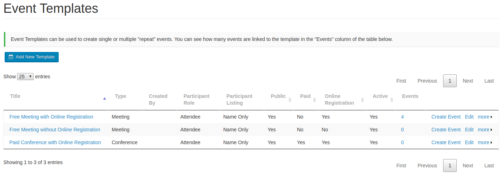
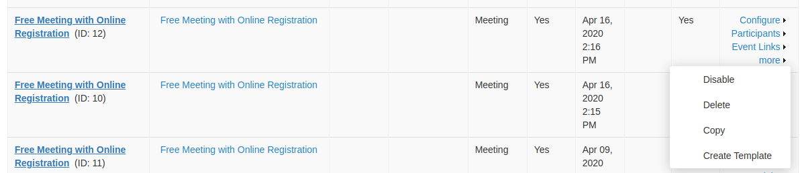
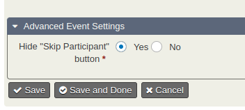

# CiviCRM Advanced Events Extension

This extension provides a number of useful features to complement/improve the CiviEvent component in CiviCRM.

It provides a more useful replacement for the event template functionality.

## Examples
#### List of event templates

#### "Activity Group" Template

## Installation

Download the latest release and install in the standard way.  There are no special installation requirements.

## Uninstallation

Uninstalling will remove all "Event Template" links.  No event data will be lost but events will no longer be linked to templates.

## Features

#### Ability to hide functionality in the UI that is not required (eg. Tell a Friend, Personal Campaigns):

#### Replace existing repeat events functionality with new based directly on Event templates.
#### Add an "Event Search/Selector" that allows "Copy Participants" and "Delete Event" actions:

* Replaces "Manage Event Templates" with a new datatables based page.
* Add Copy template link to event templates list:

* Add ability to create templates from existing events:

#### Adds an EventTemplate API.
#### Adds event template permissions.

### Multiple event participant registration

#### Price field visibility options for multiple event participants

Adds a new option to the Price Set "Price Option" to select whether it should be visible
always, only for main participant or only for additional participants.

#### Hide "Skip Participant" button

Adds an option to the event configuration to hide the "Skip Participant" button
so that the person registering is forced to fill in all participants.
This is useful eg. for a group ticket when you must register 4 people in the "group".

## Usage

Navigate to Administer->CiviEvent->Advanced Events Configuration to configure.

To find events by template: Events->Find (Events by template).

To manage event templates: Events->Event Templates.

## Tutorial
1. To create a series of events first set up a template for your event.
2. While creating it if you want to create your series at the same time as creating the template,
then you can create a bunch of events via the Repeat tab.
*But note that the 'repeat settings' (eg ever Monday for 6 weeks) do not get saved in the template*
3. If later you want to create a single event based on the template then you click on the `Create` on
   the ui showing all the `Event Templates` but this does not give you the ability to make multiple events.
4. If you want to do that, eg to add a series for Tuesdays then you need to click `Edit` for the relevant
   template and go back to the Repeat tab of the Event Template, and fire them off from that screen.

### Repeating Events

In order to manage repeating events, a template should be created for the event. Within these templates the Repeat functionality can be accessed and "extra" events can be added to the series, giving much better management of related events. It should be notes that this extension overrides the standard CiviCRM behaviour with repetition on the actual event itself to improve functionality.

## Permissions

The following permissions for events are implemented for this extension:

* CiviEvent: Create Event.
* CiviEvent: View own event templates.
* CiviEvent: View all event templates.
* CiviEvent: Edit own event templates.
* CiviEvent: Edit all event templates.
* CiviEvent: Delete own event templates.
* CiviEvent: Delete all event templates.

## Support and Maintenance

This extension is supported and maintained with the help and support of the CiviCRM community by [MJW](https://www.mjwconsult.co.uk).

We offer paid [support and development](https://mjw.pt/support) as well as a [troubleshooting/investigation service](https://mjw.pt/investigation).