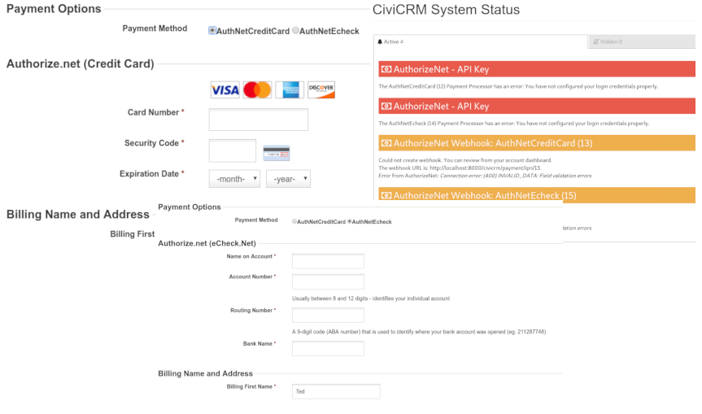

# CiviCRM Authorize.Net Payment processor

CiviCRM Extension that provides full support for Authorize.Net payments using Credit Card, echeck (EFT) and Accept.js.

The extension is licensed under [AGPL-3.0](LICENSE.txt).

## Documentation

See: https://docs.civicrm.org/authnetecheck

## Support and Maintenance

This extension is supported and maintained with the help and support of the CiviCRM community by [MJW](https://www.mjwconsult.co.uk).

We offer paid [support and development](https://mjw.pt/support) as well as a [troubleshooting/investigation service](https://mjw.pt/investigation).