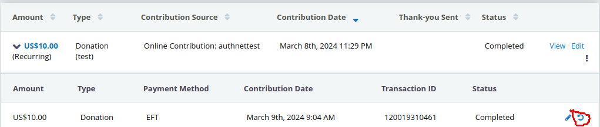
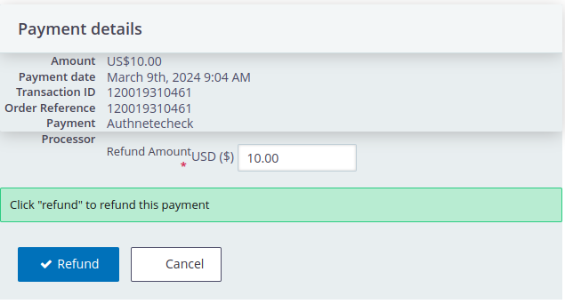

## How do I issue Refunds?

1. Enable the "Enable refund payment via UI?" setting in 
*Administer->CiviContribute->Payment Shared Settings*
2. Find a Completed contribution and expand to show "Payments".
3. Click the "reverse" arrow (highlighted in red:
  .
4. A refund form will pop up where you can confirm the details and choose the amount to refund:
  
5. Click "Refund".

CiviCRM will then confirm if the refund was successful or not and record a refund payment on the contribution.

## Terminology

#### CiviCRM <=> AuthorizeNet

* A CiviCRM **Recurring Contribution** is the equivalent of a AuthorizeNet **Subscription**.
* A CiviCRM **Contribution** is the equivalent of a AuthorizeNet **Transaction**.
* A CiviCRM **Payment** is the equivalent of a AuthorizeNet **Settled Transaction**.
* A CiviCRM **Contact** is the equivalent of a AuthorizeNet **Customer**.

Note that a collection of payments on a subscription have the *same* invoice ID but separate transaction IDs.

## Invoice number, Transactions, Payments, Subscriptions

CiviCRM generates an invoice ID for AuthorizeNet: It's the first 20 characters of the auto-generated invoice_id.

|Field|CiviCRM entity|AuthorizeNet|CiviCRM field|
|---|---|---|---|
|Subscription ID|ContributionRecur|Subscription ID|trxn_id/processor_id|
|Order Reference/Invoice|Contribution|Invoice Number|Not used (invoice_id)|
|Transaction ID|Contribution|Transaction ID|trxn_id|
|Transaction ID|Payment|Transaction ID|trxn_id|
|Order Reference|Payment|Transaction ID|order_reference|

