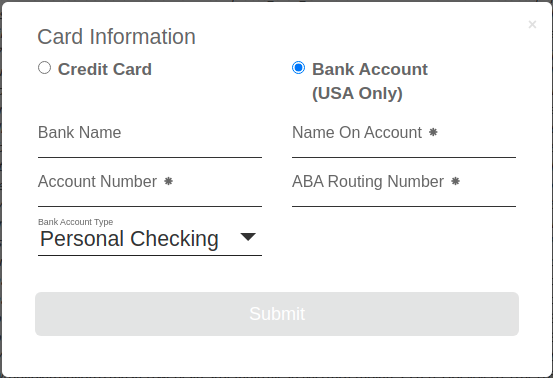
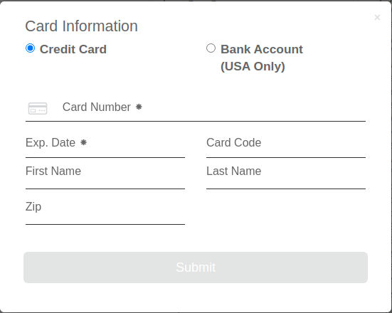

# CiviCRM Authorize.Net Payment processor

CiviCRM Extension that provides full support for Authorize.Net payments using Credit Card, echeck (EFT) and Accept.js.

It provides support for the following Authorize.net products:
- Credit Card
- echeck (EFT)
- Accept.js (PCI compliant solution that accepts all Authorize.net payment types).

Recurring payments and notifications are supported.

#### Authorize.net CreditCard/eCheck

#### Authorize.net Accept.js ACH/EFT:

#### Authorize.net Accept.js CreditCard:

## Features

* Provides a payment processor for the Authorize.net Accept.js API.
* Provides a payment processor eCheck.Net/Credit Card based on Authorize.Net API (AIM Method).
* Supports Recurring Contributions using Authorize.Net Automated Recurring Billing (ARB)
* Supports Webhooks: https://developer.authorize.net/api/reference/features/webhooks.html
* Supports Refunds.

## Installation

**The [Payment Shared](https://lab.civicrm.org/extensions/mjwshared) extension is required and MUST be installed.**

## Setup

1. Add a New Payment Processor of type `Authorize.Net (eCheck.Net)` or `Authorize.Net (Credit Card)` in the menu via *Administer->System Settings->Payment Processors*.

## Webhooks

Webhooks are configured automatically when a payment processor is created.
A System Check message will identify problems and help set them up if required.

## Development

* Webhooks based on stymiee/authnetjson library - http://www.johnconde.net/blog/handling-authorize-net-webhooks-with-php/

## Support and Maintenance

This extension is supported and maintained with the help and support of the CiviCRM community by [MJW](https://www.mjwconsult.co.uk).

We offer paid [support and development](https://mjw.pt/support) as well as a [troubleshooting/investigation service](https://mjw.pt/investigation).