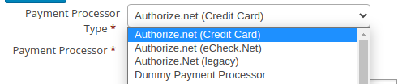
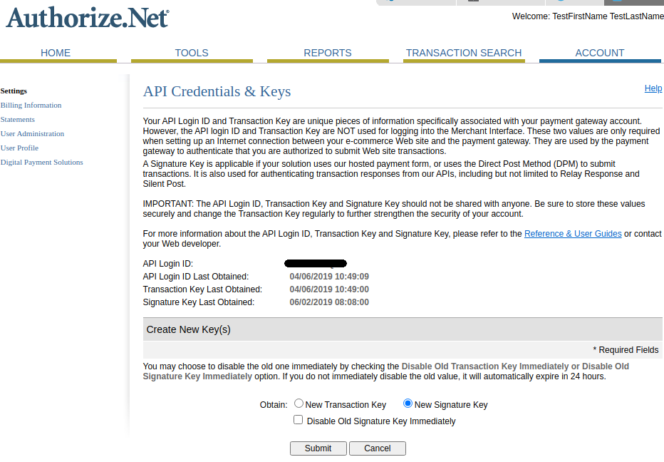
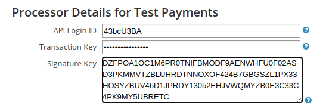

# Setup

## Configure Payment Processor

This extension provides two payment processors:

* Authorize.net (Credit Card).
* Authorize.net (eCheck.Net).

The older core payment processor Authorize.net (legacy), if available, should not be used.

## Authorize.net API credentials

Both eCheck.Net and Credit Card should be configured with the same API credentials.

Login to your Authorize.net dashboard and select *Settings*->*API Credentials and Keys*:

Generate and get your API Login ID, Transaction Key and Signature Key.

Now create a payment processor in CiviCRM and enter those details:

## Skip webhook checks on the test processor

Because of authorize.net's use of "test mode", it's difficult for this extension to verify webhooks on the "test" payment processor. You may wish to disable these checks.

To do so, enter `AUTHNETECHECK_SKIP_WEBHOOK_CHECKS` in the _API Login ID_ field.
